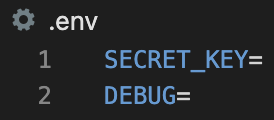

# Internet Banking Application

## Caroline Crandell

**What does this application do and why?**

I have developed an internet banking application where users are able to:

<!-- - Create an account (username, first name, last name, email, and password) -->
- Check their current balance
- View a history of transactions
- Deposit money
- Transfer money
- Withdraw money


**How the application is organised**

The internet banking application is divided into the following folders:

- **images folder** - contains images for this README document
- **bank folder** - contains the fundamental code used to run the internet banking application (including settings.py)
- **internet_banking folder** - contains the static files, database structure, and functionality of the NHS forms and clinician portal
- **react-bank folder** - contains the React app frontend files
<!-- - **.dockerignore** - document that indicates which files to omit from the Docker container -->
- **.gitignore** - document that indicates which files to omit from the GitHub repository, such as the myvenv folder and the environment variables (i.e., passwords stored in the .env file)
<!-- - **docker-compose.yml** - contains instructions for building a Docker container -->
<!-- - **Dockerfile** - contains instructions for creating a Docker image -->
- **manage.py file** - contains the code to run the internet banking application
- **README** - this document, providing background information for the application
- **requirements.txt** - contains the instructions of which packages to install when creating a new virtual environment
- **myvenv folder** - (in the .gitignore) contains the packages and virtual environment to run the internet banking application
- **db.sqlite3** - (in the .gitignore) the database file
<!-- - **internet_banking.log** - (in the .gitignore) the log to document notable events that occur when users interact with the internet banking application -->

**Step-by-Step on how to run the application**

First clone this application repository on to your computer. Open your Terminal and navigate to where you would like to download the source code. Then for SSH, type:

```js
git clone git@github.com:cecrandell/bank.git
```

Or for HTTPS, type:

```js
git clone https://github.com/cecrandell/bank.git
```

Now that you have downloaded the application on to your computer, please ensure that you have [Python3 installed](https://realpython.com/installing-python/) on your computer. Then navigate to the root folder in your Terminal and create a new virtual environment:

```js
python3 -m venv myvenv
```

After installation, please activate your virtual environment:

```js
source myvenv/bin/activate
```

Now ensure that the latest version of pip is installed in your virtual environment:

```js
python -m pip install --upgrade pip
```

After downloading/upgrading pip, please install Django and other relevant packages in your virtual environment:

```js
pip install -r requirements.txt
```

In the mysite folder in the root folder of the repository, create a .env file that provides the following passwords:



All login details should be customized to your accounts, however, to acquire the Django Secret Key, please contact the developer (contact details below). 

<!-- After all login details are configured, please create a signer.py file with the following contents in the root folder of the repository:

 -->

Then make migrations to initialize the database:

```js
python manage.py makemigrations
```

Then migrate the database:

```js
python manage.py migrate
```

Then create a login:

```js
python manage.py createsuperuser
```

And follow the Terminal prompts to create a new superuser.

You may now launch the application in your browser:

```js
python manage.py runserver
```

<!-- # To Set Up Docker (Optional)

To build the Docker image:

```js
docker-compose build
```

To run the Docker container:

```js
docker-compose up -d
```

To acquire the Docker container ID:

```js
docker ps
```

Copy the Docker container ID and in a new Terminal, type:

```js
docker exec -it [copied Docker container ID] /bin/sh
```

Make migrations to initialize the database within the Docker container:

```js
python manage.py makemigrations
```

Then migrate the database within the Docker container:

```js
python manage.py migrate
```

Then create a login within the Docker container:

```js
python manage.py createsuperuser
```

And follow the prompts below within the Docker container:

 -->

<!-- **Links to deployed version of application**

- AWS Site: -->

**Technologies Used**

- React
- Django
- Python
- SQLite
<!-- - Docker -->
- CSS
- HTML

**Developer**

- Caroline Crandell - cecrandell - cecrandell19@gmail.com

<!-- https://blog.logrocket.com/using-react-django-create-app-tutorial/ -->
